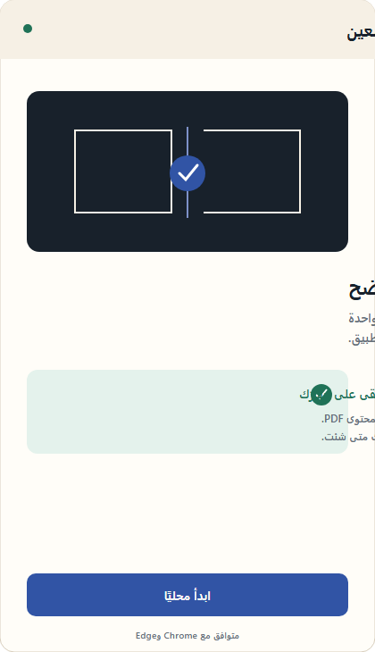
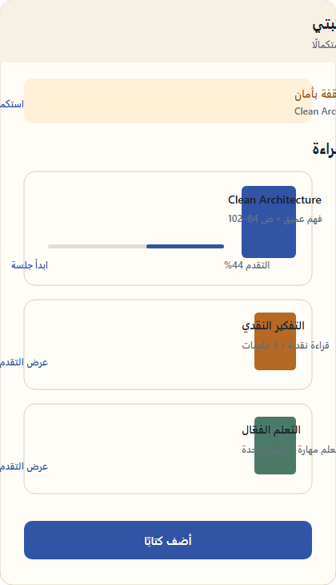
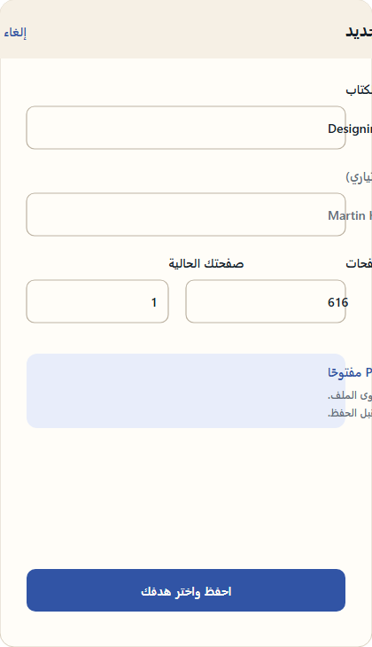
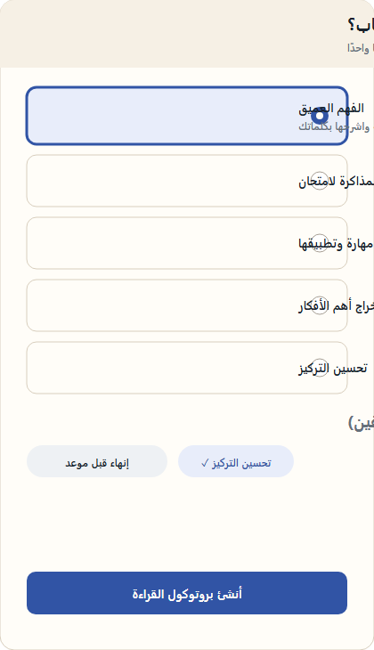
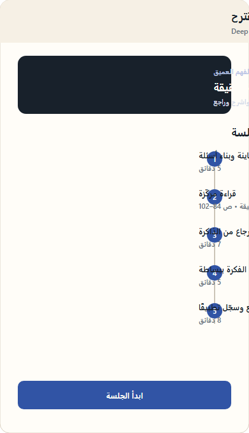
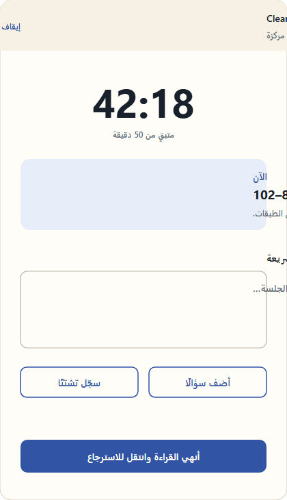
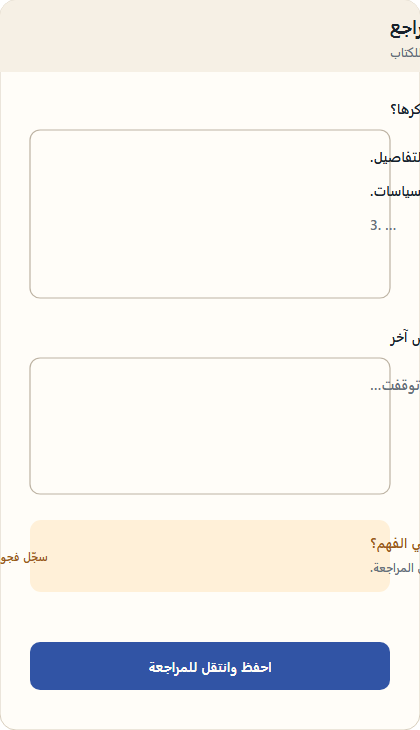
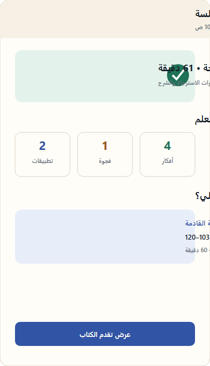
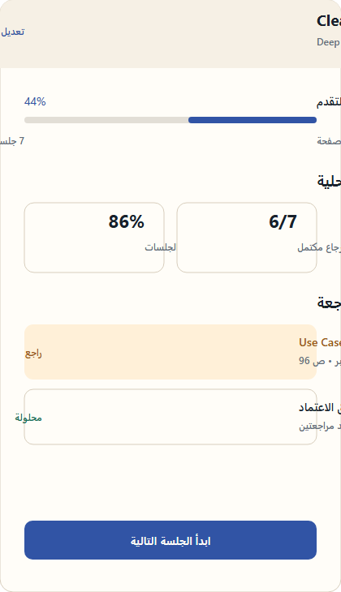
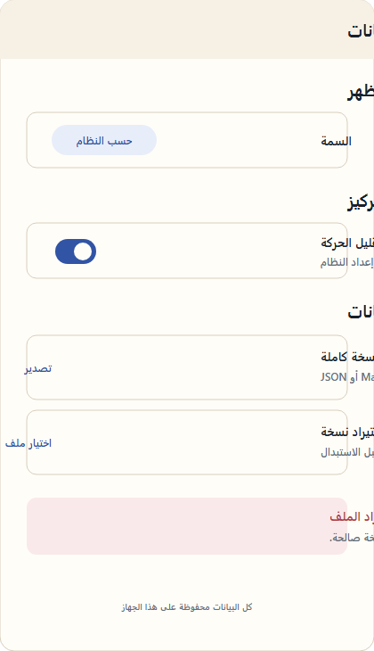

# Maeen — Reading Helper

**Maeen** is an Arabic-first, local-first browser extension that turns *why* you are reading into one focused next action beside the browser's existing PDF viewer.


## What is Maeen?

Maeen helps readers turn an intention into a clear reading session that can be completed and reviewed. It opens in the browser Side Panel beside the existing PDF viewer and stays deliberately focused: choose a goal, receive a deterministic reading protocol, run a focus session, then record recall, review, and application notes.

Arabic is the interface language and structural direction (RTL), not a requirement for the book. Maeen works with Arabic, English, or any other book language. It does not replace the PDF viewer or try to understand the book's pages; it is a planning and reflection workspace beside the viewer.

The extension stores reading references, plans, sessions, notes, and progress locally. It never reads, parses, uploads, or transmits PDF content.

## How does it help readers?

1. **Start with a reason:** define why you are reading instead of opening an unstructured session.
2. **Get a practical path:** turn the goal into ordered steps and save the protocol version with the plan.
3. **Protect focus:** the session timer uses absolute timestamps and safely handles browser suspension and restarts.
4. **Remember actively:** recall, review, and application prompts save your outputs locally instead of relying on rereading alone.
5. **See progress:** local metrics show completed sessions, gaps, and applications without sending data to a server.
6. **Recover your work:** after an interruption, the recovery screen explains what was preserved and offers a safe resume or abandon choice.

## What happens when I use it?

After explicit browser invocation, the extension may read only the active tab's title and URL as a transient reference. HTTPS and `file:` URLs are accepted according to the user's permission state; restricted pages and missing metadata become explicit states. Maeen never fetches the URL, reads PDF text or bytes, inspects headers or MIME, or sends the reference to an account or external service.

Books, plans, sessions, and notes are stored locally in IndexedDB. Chrome Storage is limited to small preferences such as theme settings. Export is manual and local; import validates, previews, backs up, migrates, and rolls back before changing local data.

## Frequently asked questions

### Does Maeen read PDF files?

No. The extension does not use PDF bytes, text, page counts, response headers, or MIME information. Keep the PDF open in the browser's native viewer and use Maeen beside it.

### Does it require an account or internet access?

No. Core features run locally without an account, network connection, analytics, or telemetry.

### Is my data uploaded to the cloud?

No. The MVP has no backend or cloud sync. Export happens only when you request it and the browser saves the result locally.

### What happens if the browser closes during a session?

The in-progress state is saved locally. When you return, Maeen offers a safe session recovery choice without deleting your notes.

### Does it work with Edge?

Yes. Maeen targets Chrome and Microsoft Edge with Manifest V3. Firefox, mobile browsers, and Acrobat integrations are outside this version.

### Can I delete or move my data?

Yes. You can manually export JSON or Markdown and import a copy after validation and preview. Nothing is sent automatically to another party.

## MVP boundary

Included: onboarding, local book library, goal selection, deterministic protocol selection, versioned plans, guided sessions, resilient timers, recall/review/application notes, progress, settings, JSON/Markdown export, guarded import, recovery, and Chrome/Edge Manifest V3 Side Panel support.

Excluded: PDF bytes/text/headers/MIME inspection, custom PDF rendering, annotations, backend/accounts/cloud sync, analytics/telemetry, AI/RAG, content-language detection, Firefox/mobile/Acrobat integrations, and social features.

## Repository map

- `PRODUCT.md` — product promise, users, MVP boundary, and non-goals.
- `DESIGN.md` — implementation-facing visual system.
- `MEMORY.md` — concise continuation context.
- `STATUS.md` — verified status and evidence.
- `AGENTS.md` — contributor and agent operating rules.
- `docs/product/` — scope, flows, information architecture, and protocols.
- `docs/design/` — design system, UI inventory, and accessibility requirements.
- `docs/architecture/` — data model, state machine, privacy, and recovery.
- `docs/delivery/` — plans, workflow, release evidence, and source links.
- `design/figma/` and `design/miro-prototype/` — local visual reference artifacts.
- `src/` — Preact/TypeScript application and domain/storage code.
- `scripts/` — browser and release verification utilities.

## Local development

Requirements: Node `24.19.0` and npm `11.17.0` (the release toolchain is intentionally pinned).

```powershell
npm ci
npm run dev
npm run test
npm run build
npm run check
```

`npm run build` writes the unpacked production extension to `dist/`. Load `dist/` from `chrome://extensions` or `edge://extensions` with Developer Mode enabled. The default Side Panel path is `sidepanel.html`.

## Data, permissions, and privacy

- IndexedDB stores domain records; Chrome Storage Local stores small preferences.
- JSON/Markdown export is user-triggered and local. JSON import validates, migrates supported envelopes, previews counts, creates a backup, commits atomically, verifies by re-reading, and rolls back on failure.
- The manifest requests only `sidePanel`, `storage`, and `activeTab`. There are no host permissions, content scripts, `tabs`, `scripting`, or `webRequest` permissions.
- Active document context is limited to transient title/URL metadata after explicit invocation. No PDF bytes, text, headers, MIME response, URL fetch, or remote identifier is accessed.
- Import recovery keeps only a local phase/timestamp marker and never stores document metadata.

Read the full [privacy and security policy](docs/architecture/PRIVACY_SECURITY.md), [backup/recovery contract](docs/architecture/BACKUP_RECOVERY.md), and [MVP scope](docs/product/MVP_SCOPE.md).

## Verification and release operations

Run `npm run release:verify` for a clean-install check, manifest/asset validation, production build, package inspection, SHA-256 evidence, and reproducibility comparison. Browser evidence is produced by:

```powershell
node scripts/verify-extension.mjs chrome <chrome-for-testing.exe> <chromedriver.exe> --core --true-restart --import
node scripts/verify-extension.mjs edge <msedge.exe> <msedgedriver.exe> --core --true-restart --import
```

Use matching browser and WebDriver versions with an isolated profile. Evidence is written under the ignored `output/` directory. WebDriver currently cannot invoke the toolbar action because of its DevTools allowlist; verification opens the registered Side Panel document directly and checks `chrome.sidePanel.getOptions()`.

## Alpha status

`REL-002 Internal Alpha v0.1` is the current release gate. The package is for controlled local testing and is not a public store release. Store metadata and draft packages live under `docs/release/`; the canonical repository is [github.com/devabdelrahmannasr/maeen](https://github.com/devabdelrahmannasr/maeen), with support through [GitHub Issues](https://github.com/devabdelrahmannasr/maeen/issues) and privacy details in [`PRIVACY_SECURITY.md`](docs/architecture/PRIVACY_SECURITY.md). Planned user research remains explicitly unvalidated.

## Marketplace preview assets

The draft listing package includes ten privacy-safe Arabic RTL screen exports from the [Figma MVP screen board](https://www.figma.com/design/AwmNEUtZBnWzs5jjNgu0VW/), plus a supplemental recovery-state reference. The exports are stored locally in [`docs/release/store-assets/`](docs/release/store-assets/) and contain no private user data or PDF content. Branding sources are [maeen-logo.svg](public/branding/maeen-logo.svg) and [maeen-cover.svg](docs/release/maeen-cover.svg). The package remains unpublished by choice; marketplace publication is outside this internal-alpha release.

### Figma screen gallery

These are the ten MVP surfaces used for the marketplace draft. The Arabic copy is product UI content, while this repository's documentation remains English for contributors.

| Screen | Preview |
| --- | --- |
| 1. Onboarding and privacy |  |
| 2. Library |  |
| 3. New book |  |
| 4. Goal selection |  |
| 5. Protocol preview |  |
| 6. Focus session |  |
| 7. Recall and explain |  |
| 8. Session summary |  |
| 9. Book progress |  |
| 10. Settings and import |  |

## Contributing and security

See [CONTRIBUTING.md](CONTRIBUTING.md) for the development and review workflow and [SECURITY.md](SECURITY.md) for private vulnerability reporting. The project is licensed under the [MIT License](LICENSE).
