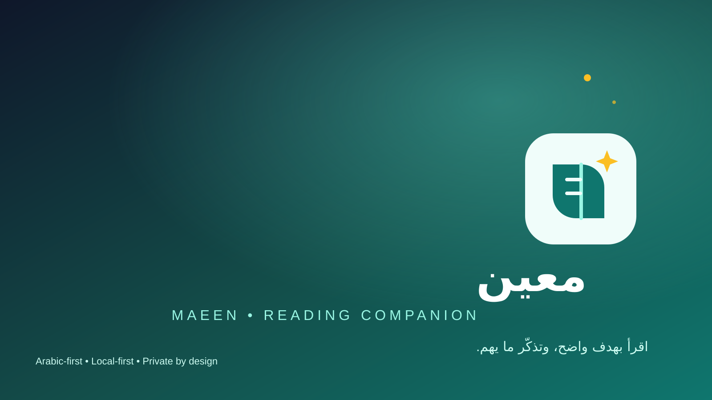

# معين — Maeen

**Maeen** is an Arabic-first, local-first browser extension that turns *why* you are reading into one focused next action beside the browser's existing PDF viewer.



## ما هي معين؟

**معين** إضافة قراءة تساعدك على تحويل نية القراءة إلى جلسة واضحة يمكن إكمالها ومراجعتها. تفتح الإضافة في Side Panel بجانب عارض PDF الموجود في المتصفح، وتبقى خفيفة ومركزة: تختار هدفك، تحصل على بروتوكول قراءة حتمي، تنفذ جلسة تركيز، ثم تسجل الاسترجاع والمراجعة والتطبيق.

اللغة العربية هي لغة الواجهة واتجاهها البنيوي RTL، وليست شرطًا للكتاب. يمكنك استخدام معين مع كتاب عربي أو إنجليزي أو أي لغة أخرى. الإضافة لا تستبدل عارض PDF ولا تحاول فهم صفحات الكتاب؛ هي مساحة تنظيم وتفكير بجانب العارض.

## كيف تساعد القارئ؟

1. **تبدأ من السبب:** تحدد لماذا تقرأ بدل فتح جلسة بلا هدف.
2. **تحصل على مسار عملي:** يحول الهدف إلى خطوات مرتبة ونسخة بروتوكول محفوظة مع الخطة.
3. **تحافظ على التركيز:** مؤقت الجلسة يستخدم وقتًا مطلقًا ويتعامل مع تعليق المتصفح وإعادة تشغيله بأمان.
4. **تتذكر بفاعلية:** أسئلة الاسترجاع والمراجعة والتطبيق تحفظ مخرجاتك محليًا بدل الاعتماد على إعادة القراءة فقط.
5. **ترى تقدمك:** تعرض المقاييس المحلية الجلسات المكتملة والفجوات والتطبيقات دون إرسال بيانات إلى خادم.
6. **تستعيد عملك:** عند التعطل أو التوقف، تشرح شاشة الاستعادة ما حُفظ وتقدم خيار المتابعة أو الترك.

## ماذا يحدث عند الاستخدام؟

بعد الاستدعاء الصريح من المتصفح، قد تقرأ الإضافة عنوان التبويب النشط ورابطه فقط كمرجع عابر. تقبل HTTPS و`file:` وفق صلاحية المستخدم، وتتعامل مع الصفحات المقيدة أو البيانات الناقصة كحالات واضحة. لا تُحمّل الإضافة الرابط، ولا تقرأ نص PDF أو بايتاته أو ترويساته أو MIME، ولا تضع المرجع في حساب أو خدمة خارجية.

كل كتبك وخططك وجلساتك وملاحظاتك في IndexedDB محليًا. تقتصر Chrome Storage على التفضيلات الصغيرة مثل المظهر. التصدير يدوي ومحلي، والاستيراد يمر بالتحقق والمعاينة والنسخ الاحتياطي والهجرة والتراجع قبل تعديل البيانات.

## أسئلة مهمة

### هل تقرأ معين ملف PDF؟

لا. لا تستخدم الإضافة محتوى الملف أو النص أو عدد الصفحات أو ترويسات الاستجابة. يمكنك إبقاء PDF مفتوحًا في العارض الأصلي واستخدام معين بجانبه.

### هل تحتاج إلى حساب أو إنترنت؟

لا. الوظائف الأساسية تعمل محليًا دون حساب أو اتصال شبكة أو تحليلات.

### هل بياناتي تُرفع إلى السحابة؟

لا. لا يوجد backend أو cloud sync في نسخة MVP. التصدير لا يحدث إلا عندما تطلبه أنت ويحفظه المتصفح محليًا.

### ماذا يحدث إذا أُغلق المتصفح أثناء الجلسة؟

تُحفظ الحالة المرحلية محليًا. عند العودة، تعرض الإضافة استعادة آمنة للجلسة أو تركها دون حذف ملاحظاتك.

### هل تعمل مع Edge؟

نعم، تستهدف معين Chrome وMicrosoft Edge مع Manifest V3. لا تستهدف Firefox أو الهاتف أو Acrobat في هذه النسخة.

### هل يمكنني حذف أو نقل بياناتي؟

نعم. يمكنك تصدير JSON أو Markdown يدويًا، واستيراد نسخة بعد المعاينة والتحقق. لا تُرسل النسخة تلقائيًا لأي جهة.

The interface is Arabic and structurally RTL; the book or PDF may be written in any language. The extension stores reading references, plans, sessions, notes, and progress locally. It never reads, parses, uploads, or transmits PDF content.

## MVP boundary

Included: onboarding, local book library, goal selection, deterministic protocol selection, versioned plans, guided sessions, resilient timers, recall/review/apply notes, progress, settings, JSON/Markdown export, guarded import, recovery, and Chrome/Edge Manifest V3 Side Panel support.

Excluded: PDF bytes/text/headers/MIME inspection, custom PDF rendering, annotations, backend/accounts/cloud sync, analytics/telemetry, AI/RAG, content-language detection, Firefox/mobile/Acrobat integrations, and social features.

## Repository map

- `PRODUCT.md` — product promise, users, MVP boundary, and non-goals.
- `DESIGN.md` — implementation-facing visual system.
- `MEMORY.md` — concise continuation context.
- `STATUS.md` — verified status and evidence.
- `AGENTS.md` — contributor and agent operating rules.
- `docs/product/` — scope, flows, information architecture, and protocols.
- `docs/design/` — design system, UI inventory, and accessibility requirements.
- `docs/architecture/` — data model, state machine, privacy, and recovery.
- `docs/delivery/` — plans, workflow, release evidence, and source links.
- `design/figma/` and `design/miro-prototype/` — local visual reference artifacts.
- `src/` — Preact/TypeScript application and domain/storage code.
- `scripts/` — browser and release verification utilities.

## Local development

Requirements: Node `24.19.0` and npm `11.17.0` (the release toolchain is intentionally pinned).

```powershell
npm ci
npm run dev
npm run test
npm run build
npm run check
```

`npm run build` writes the unpacked production extension to `dist/`. Load `dist/` from `chrome://extensions` or `edge://extensions` with Developer Mode enabled. The default Side Panel path is `sidepanel.html`.

## Data, permissions, and privacy

- IndexedDB stores domain records; Chrome Storage Local stores small preferences.
- JSON/Markdown export is user-triggered and local. JSON import validates, migrates supported envelopes, previews counts, creates a backup, commits atomically, verifies by re-reading, and rolls back on failure.
- The manifest requests only `sidePanel`, `storage`, and `activeTab`. There are no host permissions, content scripts, `tabs`, `scripting`, or `webRequest` permissions.
- Active document context is limited to transient title/URL metadata after explicit invocation. No PDF bytes, text, headers, MIME response, URL fetch, or remote identifier is accessed.
- Import recovery keeps only a local phase/timestamp marker and never stores document metadata.

Read the full [privacy and security policy](docs/architecture/PRIVACY_SECURITY.md), [backup/recovery contract](docs/architecture/BACKUP_RECOVERY.md), and [MVP scope](docs/product/MVP_SCOPE.md).

## Verification and release operations

Run `npm run release:verify` for a clean-install check, manifest/asset validation, production build, package inspection, SHA-256 evidence, and reproducibility comparison. Browser evidence is produced by:

```powershell
node scripts/verify-extension.mjs chrome <chrome-for-testing.exe> <chromedriver.exe> --core --true-restart --import
node scripts/verify-extension.mjs edge <msedge.exe> <msedgedriver.exe> --core --true-restart --import
```

Use matching browser and WebDriver versions with an isolated profile. Evidence is written under the ignored `output/` directory. WebDriver currently cannot invoke the toolbar action because of its DevTools allowlist; verification opens the registered Side Panel document directly and checks `chrome.sidePanel.getOptions()`.

## Alpha status

`REL-002 Internal Alpha v0.1` is the current release gate. The package is for controlled local testing and is not a public store release. Store metadata and draft packages live under `docs/release/`; the canonical repository is [github.com/devabdelrahmannasr/maeen](https://github.com/devabdelrahmannasr/maeen), with support through [GitHub Issues](https://github.com/devabdelrahmannasr/maeen/issues) and privacy details in [`PRIVACY_SECURITY.md`](docs/architecture/PRIVACY_SECURITY.md). Planned user research remains explicitly unvalidated.

## Marketplace preview assets

The draft listing package includes synthetic, privacy-safe Arabic RTL screenshots for onboarding, Library, New Book, Protocol, Focus, Summary, Progress, Settings/import, and recovery at 320, 420, and 600 px widths. Branding sources are [maeen-logo.svg](public/branding/maeen-logo.svg) and [maeen-cover.svg](docs/release/maeen-cover.svg). The package remains unpublished by choice; marketplace publication is outside this internal-alpha release.

## Contributing and security

See [CONTRIBUTING.md](CONTRIBUTING.md) for the development and review workflow and [SECURITY.md](SECURITY.md) for private vulnerability reporting. The project is licensed under the [MIT License](LICENSE).
